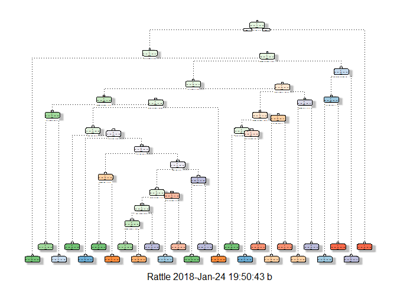
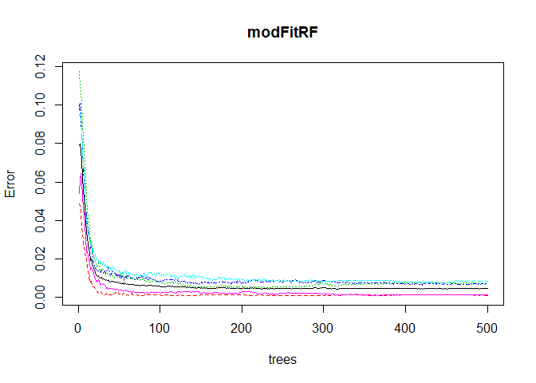

##Sinopsis
Using devices such as Jawbone Up, Nike FuelBand, and Fitbit it is now possible to collect a large amount of data about personal activity relatively inexpensively. These type of devices are part of the quantified self movement - a group of enthusiasts who take measurements about themselves regularly to improve their health, to find patterns in their behavior, or because they are tech geeks. One thing that people regularly do is quantify how much of a particular activity they do, but they rarely quantify how well they do it. In this project, your goal will be to use data from accelerometers on the belt, forearm, arm, and dumbell of 6 participants. They were asked to perform barbell lifts correctly and incorrectly in 5 different ways. More information is available from the website here: http://web.archive.org/web/20161224072740/http:/groupware.les.inf.puc-rio.br/har (see the section on the Weight Lifting Exercise Dataset).

##Sources
The data used for this project come from  http://groupware.les.inf.puc-rio.br/har. With many thanks for beeing so generous in allowing their data to be used for this kind of assignment.

1. The training data used:
https://d396qusza40orc.cloudfront.net/predmachlearn/pml-training.csv

2. The test data used:
https://d396qusza40orc.cloudfront.net/predmachlearn/pml-testing.csv


##1. First, loading the libraries needed.


```r
library(caret)
```

```
## Loading required package: lattice
```

```
## Loading required package: ggplot2
```

```r
library(rpart)
library(RColorBrewer)
library(rattle)
```

```
## Rattle: A free graphical interface for data science with R.
## Version 5.1.0 Copyright (c) 2006-2017 Togaware Pty Ltd.
## Type 'rattle()' to shake, rattle, and roll your data.
```

```r
library(rpart.plot)
library(randomForest)
```

```
## randomForest 4.6-12
```

```
## Type rfNews() to see new features/changes/bug fixes.
```

```
## 
## Attaching package: 'randomForest'
```

```
## The following object is masked from 'package:rattle':
## 
##     importance
```

```
## The following object is masked from 'package:ggplot2':
## 
##     margin
```

```r
library(knitr)
library(e1071)
library(gbm)
```

```
## Loading required package: survival
```

```
## 
## Attaching package: 'survival'
```

```
## The following object is masked from 'package:caret':
## 
##     cluster
```

```
## Loading required package: splines
```

```
## Loading required package: parallel
```

```
## Loaded gbm 2.1.3
```

```r
library(plyr)
```


##Making data folder, downloading and loading the data.


```r
if (!file.exists("PMLdata")) {dir.create("PMLdata")}
trainUrl <- "https://d396qusza40orc.cloudfront.net/predmachlearn/pml-training.csv"
trainfile <- "./PMLdata/pml-training.csv"
testUrl <- "https://d396qusza40orc.cloudfront.net/predmachlearn/pml-testing.csv"
testfile <- "./PMLdata/pml-testing.csv"
trainfile <- read.csv(url(trainUrl), na.strings=c("NA","#DIV/0!",""))
testfile <- read.csv(url(testUrl), na.strings=c("NA","#DIV/0!",""))
```

##Cleaning the data
After loading, the data must be cleaned. It contains time-related or non numerical features ( first seven colums as well) and NAs that can be removed.

```r
features <- names(testfile[,colSums(is.na(testfile)) == 0])[8:59]
```

We are using only the needed features

```r
trainfile <- trainfile [,c(features,"classe")]
testfile <- testfile[,c(features,"problem_id")]
dim(trainfile); dim(testfile);
```

```
## [1] 19622    53
```

```
## [1] 20 53
```

##Dataset partitioning:
The data slicing is needed for building the training and testing sets, for performing cross validation or boot strapping. It is done right at the beginning of prediction function creation, or in order to evaluate the prediction models.

```r
set.seed(11111)

Train01 <- createDataPartition(trainfile$classe, p=0.75, list=FALSE)
Train_A <- trainfile[Train01,]
Test_A <- trainfile[-Train01,]

dim(Train_A); dim(Test_A);
```

```
## [1] 14718    53
```

```
## [1] 4904   53
```

##Building and testing the prediction models.
1. Decision Tree Model
1.a. Building Decision Tree Model

```r
set.seed(11111)
TreeMod <- rpart(classe ~ ., data = Train_A, method="class", control = rpart.control(method = "cv", number = 5))
fancyRpartPlot(TreeMod)
```

```
## Warning: labs do not fit even at cex 0.15, there may be some overplotting
```

<!-- -->

1.b.Predicting with the Decision Tree Model

```r
set.seed(11111)

predict_A <- predict(TreeMod, Test_A, type = "class")
confusionMatrix(predict_A, Test_A$classe)
```

```
## Confusion Matrix and Statistics
## 
##           Reference
## Prediction    A    B    C    D    E
##          A 1288  138   23   33    5
##          B   43  550   60   66   78
##          C   31  174  711   88  116
##          D   24   68   60  541   61
##          E    9   19    1   76  641
## 
## Overall Statistics
##                                           
##                Accuracy : 0.7608          
##                  95% CI : (0.7486, 0.7727)
##     No Information Rate : 0.2845          
##     P-Value [Acc > NIR] : < 2.2e-16       
##                                           
##                   Kappa : 0.697           
##  Mcnemar's Test P-Value : < 2.2e-16       
## 
## Statistics by Class:
## 
##                      Class: A Class: B Class: C Class: D Class: E
## Sensitivity            0.9233   0.5796   0.8316   0.6729   0.7114
## Specificity            0.9433   0.9375   0.8990   0.9480   0.9738
## Pos Pred Value         0.8662   0.6901   0.6348   0.7175   0.8592
## Neg Pred Value         0.9687   0.9028   0.9619   0.9366   0.9375
## Prevalence             0.2845   0.1935   0.1743   0.1639   0.1837
## Detection Rate         0.2626   0.1122   0.1450   0.1103   0.1307
## Detection Prevalence   0.3032   0.1625   0.2284   0.1538   0.1521
## Balanced Accuracy      0.9333   0.7586   0.8653   0.8105   0.8426
```

2. Random Forest 
2.a. Building the Random Forest Model

```r
modFitRF <- randomForest(classe ~ ., data = Train_A, method = "rf", importance = T, trControl = trainControl(method = "cv", classProbs=TRUE,savePredictions=TRUE,allowParallel=TRUE, number = 10))

plot(modFitRF)
```

<!-- -->

2.b. Predicting with the Random Forest Model

```r
prediction <- predict(modFitRF, Test_A, type = "class")
confusionMatrix(prediction, Test_A$classe)
```

```
## Confusion Matrix and Statistics
## 
##           Reference
## Prediction    A    B    C    D    E
##          A 1394    4    0    0    0
##          B    1  942    2    0    0
##          C    0    3  853    6    0
##          D    0    0    0  795    0
##          E    0    0    0    3  901
## 
## Overall Statistics
##                                          
##                Accuracy : 0.9961         
##                  95% CI : (0.994, 0.9977)
##     No Information Rate : 0.2845         
##     P-Value [Acc > NIR] : < 2.2e-16      
##                                          
##                   Kappa : 0.9951         
##  Mcnemar's Test P-Value : NA             
## 
## Statistics by Class:
## 
##                      Class: A Class: B Class: C Class: D Class: E
## Sensitivity            0.9993   0.9926   0.9977   0.9888   1.0000
## Specificity            0.9989   0.9992   0.9978   1.0000   0.9993
## Pos Pred Value         0.9971   0.9968   0.9896   1.0000   0.9967
## Neg Pred Value         0.9997   0.9982   0.9995   0.9978   1.0000
## Prevalence             0.2845   0.1935   0.1743   0.1639   0.1837
## Detection Rate         0.2843   0.1921   0.1739   0.1621   0.1837
## Detection Prevalence   0.2851   0.1927   0.1758   0.1621   0.1843
## Balanced Accuracy      0.9991   0.9959   0.9977   0.9944   0.9996
```

##Applying the model to Testing Data
We will apply the model to the Test Data for testing the most appropriate model, Random Forest model.

```r
predictionRF <- predict(modFitRF, testfile)
predictionRF
```

```
##  1  2  3  4  5  6  7  8  9 10 11 12 13 14 15 16 17 18 19 20 
##  B  A  B  A  A  E  D  B  A  A  B  C  B  A  E  E  A  B  B  B 
## Levels: A B C D E
```

As is seen, the Random Forest Model is better.
It will be prepared for submission.

Thank you for your time.
